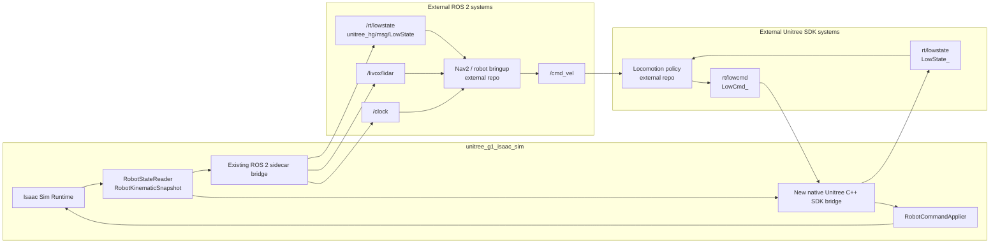
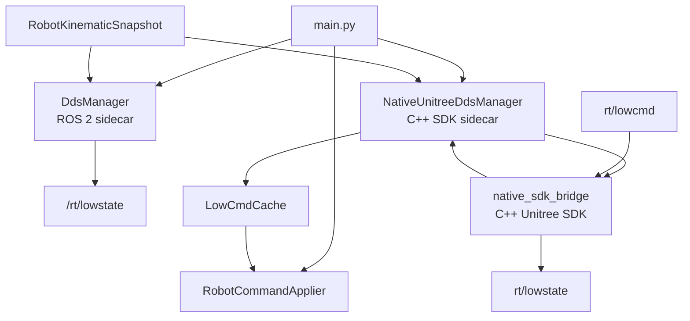
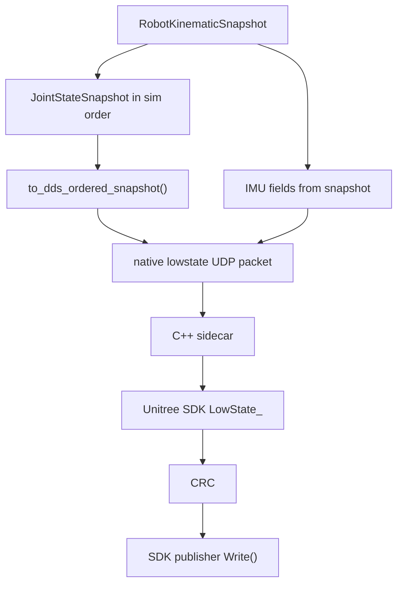
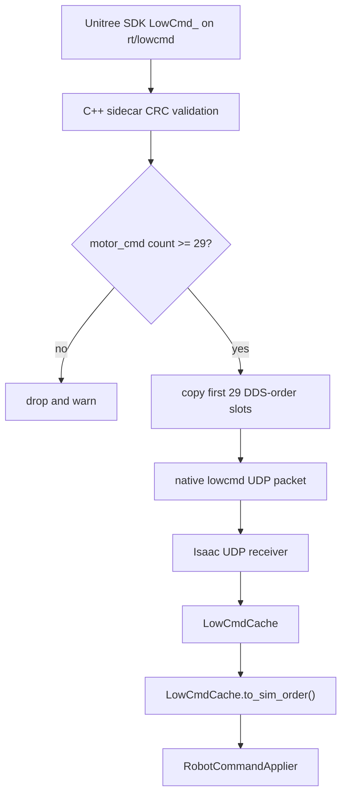

# Parallel Native Unitree C++ SDK Bridge Implementation Plan

## Goal

Add an optional native Unitree C++ SDK DDS interface in parallel with the
current ROS 2 / CycloneDDS sidecar path.

The simulator should publish state through both external interfaces:

- ROS 2:
  - `/rt/lowstate`
  - `unitree_hg/msg/LowState`
  - produced by the existing ROS 2 sidecar path
- Native Unitree C++ SDK:
  - `rt/lowstate`
  - Unitree SDK IDL `LowState_`
  - produced by a compiled C++ sidecar process through Unitree SDK channels

For command ingress, the requested architecture is stricter:

- ROS 2 low-level command ingress should be disabled or ignored for the target
  mode.
- Native Unitree C++ SDK `rt/lowcmd` should be the only low-level command source
  that writes to the simulated articulation.

This repository remains simulation-only. Locomotion policy, Nav2, robot
bringup, `/cmd_vel` bridging, and higher-level autonomy stacks live in other
codebases. This repo should expose the simulation endpoints those external
systems need; it should not become the locomotion or Nav2 application.

## Desired Final Runtime Shape



The simulator-side contract should be:

- publish ROS 2 lowstate for ROS 2 consumers
- publish native SDK lowstate for SDK consumers
- accept native SDK lowcmd for articulation control
- optionally leave ROS 2 `/rt/lowcmd` available for old tests, but provide a
  launch mode where it is disabled so command authority is unambiguous

## Non-Goals

- Do not implement the locomotion policy in this repository.
- Do not implement Nav2, robot bringup, TF publication, or `/cmd_vel` adapters
  in this repository unless explicitly moved into this repo later.
- Do not make ROS 2 `/rt/lowcmd` and native Unitree SDK `rt/lowcmd` both active by
  default.
- Do not mirror every Unitree SDK topic family.
- Do not change the validated simulator joint-order mapping unless the G1 USD
  asset changes and the mapping is revalidated.
- Do not replace the current ROS 2 sidecar path. The new C++ SDK bridge is
  additive and optional.

## Current Codebase Starting Point

The current `feat/ros2` branch already has:

- simulator state extraction:
  - `src/robot_state.py`
  - `RobotStateReader.read_kinematic_snapshot(sample_dt=...)`
- simulator command application:
  - `src/robot_control.py`
  - `RobotCommandApplier.apply_lowcmd(...)`
- validated joint-order conversion:
  - `src/mapping/joints.py`
  - `src/mapping/conversion.py`
  - `src/mapping/validator.py`
- ROS 2 sidecar lowstate/lowcmd path:
  - `src/dds/manager.py`
  - `src/dds/g1_lowstate.py`
  - `src/dds/g1_lowcmd.py`
  - `src/dds/bridge_protocol.py`
  - `scripts/ros2_cyclonedds_sidecar.py`
- simulator-native ROS 2 sensor paths:
  - `src/tooling/sim_clock.py`
  - `src/sensors/livox_mid360.py`

The prior SDK-oriented branch logic can be used as a conceptual template, but
the new implementation should be integrated intentionally into the current
sidecar-era code rather than reverting the branch.

## Interface Decision

Add explicit configuration for both ROS 2 and native Unitree SDK lowstate and
lowcmd surfaces so state publication and command ingress can be controlled
independently. Suggested CLI flags:

```bash
--enable-ros2-lowstate
--enable-ros2-lowcmd
--enable-native-unitree-lowstate
--enable-native-unitree-lowcmd
--native-unitree-domain-id 1
--native-unitree-lowstate-topic rt/lowstate
--native-unitree-lowcmd-topic rt/lowcmd
--native-unitree-bridge-exe native_sdk_bridge/build/unitree_g1_native_bridge
```

Recommended defaults:

- `--enable-ros2-lowstate`: enabled
- `--enable-ros2-lowcmd`: disabled
- `--enable-native-unitree-lowstate`: enabled
- `--enable-native-unitree-lowcmd`: enabled
- `--native-unitree-domain-id`: default to `--dds-domain-id`
- `--native-unitree-lowstate-topic`: `rt/lowstate`
- `--native-unitree-lowcmd-topic`: `rt/lowcmd`
- `--native-unitree-bridge-exe`: default to the in-repo C++ bridge build
  output

Target launch mode for the user's requested architecture:

```bash
isaac_sim_python src/main.py \
  --headless \
  --enable-dds \
  --enable-ros2-lowstate \
  --no-enable-ros2-lowcmd \
  --enable-native-unitree-lowstate \
  --enable-native-unitree-lowcmd
```

Meaning:

- keep ROS 2 lowstate, `/clock`, and `/livox/lidar`
- keep ROS 2 lowcmd disabled by default, but available for explicit testing
- publish native Unitree SDK lowstate
- accept native Unitree SDK lowcmd as the only low-level command source

## Architecture Change

Introduce a second bridge implementation beside the current ROS 2 sidecar
bridge.

Because Isaac Sim is a Python process and the requested native interface should
use the C++ Unitree SDK, the native bridge should follow a sidecar model rather
than importing SDK bindings into Isaac. Isaac Sim should exchange compact
localhost packets with a compiled C++ bridge process. The C++ process owns the
Unitree SDK channel factory, `LowState_` publication, `LowCmd_` subscription,
and CRC handling.

Build assumptions:

- the C++ sidecar should be built with CMake
- it should link against the Unitree C++ SDK and its DDS dependencies
- Isaac Sim should not need Unitree SDK headers or libraries inside its Python
  environment
- `NativeUnitreeDdsManager` should check that the configured bridge executable
  exists before starting native mode

Suggested new files:

```text
src/dds/native_bridge_protocol.py
src/dds/native_udp_lowstate.py
src/dds/native_udp_lowcmd.py
src/dds/native_manager.py
native_sdk_bridge/CMakeLists.txt
native_sdk_bridge/src/main.cpp
native_sdk_bridge/src/bridge_protocol.hpp
native_sdk_bridge/src/lowstate_publisher.cpp
native_sdk_bridge/src/lowcmd_subscriber.cpp
native_sdk_bridge/include/native_sdk_bridge/*.hpp
src/dds/command_source.py
```

Alternative:

- integrate the native manager directly into `src/dds/manager.py`
- only do this if the code remains clear

Recommended approach:

- keep the native C++ SDK sidecar lifecycle separate in
  `NativeUnitreeDdsManager`
- let `main.py` orchestrate both the current `DdsManager` and the new native
  manager
- use a small command-source combiner only if more than one lowcmd source can
  be enabled at once



## Command Authority Policy

The simulator must avoid ambiguous low-level control. Lowstate publication may
run in parallel across both external interfaces, but low-level command
authority must remain unambiguous.

Target policy:

- ROS 2 lowstate and native Unitree SDK lowstate may both be enabled at the
  same time
- ROS 2 lowcmd and native Unitree SDK lowcmd must not both be active at the
  same time
- default command authority should be native Unitree SDK lowcmd
- ROS 2 lowcmd remains available behind an explicit flag for later testing

Preflight guard:

- add a startup validation check that runs before bridge initialization
- if both `--enable-ros2-lowcmd` and `--enable-native-unitree-lowcmd` are
  true, fail startup with a clear configuration error

```text
startup error:
  "multiple lowcmd sources enabled: ROS 2 sidecar and native Unitree SDK.
   Enable only one lowcmd source at a time."
```

Normalization rule:

- if one lowcmd flag is enabled for a given launch mode, the other lowcmd
  source should be treated as off for that mode
- this keeps the command path single-authority by construction
- do not auto-merge or arbitrate between lowcmd sources in the first
  implementation

This should be implemented as a preflight check in config validation or early
startup, before any DDS sidecar or native bridge subprocess is started.

## Shared Internal Lowcmd Shape

The current `src/dds/g1_lowcmd.py` defines:

- `LowCmdCache`
- `SimOrderLowCmd`

That type is useful beyond the ROS 2 sidecar path. Move or duplicate carefully.

Preferred refactor:

```text
src/dds/lowcmd_types.py
```

Containing:

- `SimOrderLowCmd`
- `LowCmdCache`
- maybe `LowCmdSource`

Then update:

- `src/dds/g1_lowcmd.py`
- new `src/dds/native_udp_lowcmd.py`
- `src/robot_control.py`
- tests

This avoids importing ROS-side UDP implementation details just to share a
command cache dataclass.

## Native Lowstate Path

Create an Isaac-side UDP sender and a C++ SDK-side DDS publisher:

```text
src/dds/native_udp_lowstate.py
native_sdk_bridge/src/lowstate_publisher.cpp
```

Responsibilities:

- Isaac side:
  - accept `RobotKinematicSnapshot`
  - convert joint-aligned fields through `to_dds_ordered_snapshot(...)`
  - encode a localhost packet for the native C++ sidecar
  - send the packet to the C++ sidecar over UDP
  - maintain publish/skip stats
- C++ sidecar:
  - own the Unitree SDK channel factory
  - create `ChannelPublisher<LowState_>` or the equivalent C++ SDK publisher
  - populate first 29 body motor states from the packet
  - populate IMU state
  - increment or forward `tick`
  - calculate CRC using the C++ SDK helper
  - write `LowState_` on `rt/lowstate`

State conversion path:



Implementation notes:

- Keep simulator internal orientation as `wxyz`.
- Verify native `LowState_` IMU quaternion expected field ordering before
  finalizing. If the SDK path expects `xyzw`, convert only at the native DDS
  packaging boundary and document it in code.
- Preserve the mapping constraint: all joint-aligned state must pass through
  `to_dds_ordered_snapshot(...)`.
- Do not use host wall time for IMU acceleration.

Expected Isaac-side public class:

```python
class NativeLowStateUdpPublisher:
    def __init__(self, host: str, port: int) -> None: ...
    def initialize(self) -> bool: ...
    def publish(self, snapshot: RobotKinematicSnapshot) -> bool: ...
    def close(self) -> None: ...
```

Expected C++ sidecar responsibilities:

```cpp
class LowStatePublisher {
public:
  bool initialize(int domain_id, const std::string& topic);
  void publish(const LowStatePacket& packet);
};
```

## Native Lowcmd Path

Create an Isaac-side UDP receiver and a C++ SDK-side DDS subscriber:

```text
src/dds/native_udp_lowcmd.py
native_sdk_bridge/src/lowcmd_subscriber.cpp
```

Responsibilities:

- C++ sidecar:
  - create `ChannelSubscriber<LowCmd_>` or the equivalent C++ SDK subscriber
  - validate CRC using the C++ SDK helper when CRC is populated; accept zero CRC
    because several Unitree HG examples publish `LowCmd_` without setting CRC
  - reject messages with fewer than 29 motor slots
  - clamp messages with more than 29 motor slots to the body joint count
  - encode the first 29 DDS-order body command slots into a localhost packet
  - send that packet to Isaac over UDP
- Isaac side:
  - receive native lowcmd localhost packets
  - decode DDS-order vectors
  - cache a `LowCmdCache`
  - expose `latest_command`
  - support `clear_cached_command()`

Command conversion path:



Expected Isaac-side public class:

```python
class NativeLowCmdUdpSubscriber:
    def __init__(self, bind_host: str, bind_port: int) -> None: ...
    @property
    def latest_command(self) -> LowCmdCache | None: ...
    def initialize(self) -> bool: ...
    def poll(self) -> None: ...
    def clear_cached_command(self) -> None: ...
    def close(self) -> None: ...
```

Expected C++ sidecar responsibilities:

```cpp
class LowCmdSubscriber {
public:
  bool initialize(int domain_id, const std::string& topic);
  void on_message(const LowCmd_& message);
};
```

## Native Manager

Create `src/dds/native_manager.py`.

Responsibilities:

- own the native C++ sidecar subprocess lifecycle
- own native lowstate UDP sender
- own native lowcmd UDP receiver
- schedule native lowstate publication at the configured lowstate cadence
- expose latest fresh native lowcmd
- implement lowcmd stale timeout using the existing semantics
- clear transient state on simulator reset
- log cadence diagnostics if desired

Class shape:

```python
class NativeUnitreeDdsManager:
    @property
    def latest_lowcmd(self) -> LowCmdCache | None: ...
    def initialize(self) -> bool: ...
    def step(self, simulation_time_seconds: float, snapshot: RobotKinematicSnapshot) -> NativeDdsStepResult: ...
    def reset_runtime_state(self) -> None: ...
    def shutdown(self) -> None: ...
```

Cadence choice:

- use the same `--lowstate-publish-hz` initially
- optionally add `--native-unitree-lowstate-publish-hz` later only if ROS 2 and
  native SDK consumers need different rates

## Main Loop Integration

Update `src/main.py` to support two independent state publishers and one
selected lowcmd source.

Current main loop applies:

```python
command_applier.apply_lowcmd(dds_manager.latest_lowcmd)
```

Target structure:

```python
active_lowcmd = resolve_active_lowcmd(
    ros2_manager=dds_manager,
    native_manager=native_dds_manager,
    config=config,
)
command_applier.apply_lowcmd(active_lowcmd)
```

In the target user mode:

- `native_dds_manager.latest_lowcmd` is the active command source because
  `--enable-native-unitree-lowcmd` is on
- `dds_manager.latest_lowcmd` is inactive because `--enable-ros2-lowcmd` is
  off

State publication:

```python
if snapshot is not None:
    if dds_manager is not None:
        dds_manager.step(simulation_time_seconds, snapshot)
    if native_dds_manager is not None:
        native_dds_manager.step(simulation_time_seconds, snapshot)
```

Reset:

```python
if dds_manager is not None:
    dds_manager.reset_runtime_state()
if native_dds_manager is not None:
    native_dds_manager.reset_runtime_state()
```

Shutdown:

```python
if native_dds_manager is not None:
    native_dds_manager.shutdown()
```

## Config Updates

Update `AppConfig` and `build_arg_parser()` with native Unitree C++ SDK
settings.

Suggested fields:

```python
enable_ros2_lowstate: bool
enable_ros2_lowcmd: bool
enable_native_unitree_lowstate: bool
enable_native_unitree_lowcmd: bool
native_unitree_domain_id: int | None
native_unitree_lowstate_topic: str
native_unitree_lowcmd_topic: str
native_unitree_bridge_exe: Path
```

Validation:

- if `native_unitree_domain_id` is omitted, use `dds_domain_id`
- if both lowcmd sources are enabled, fail during config validation or startup
  preflight
- lowstate may remain enabled for both transports simultaneously
- native bridge availability should still be checked at startup so the repo
  remains usable without native SDK support when native mode is not required

Optional strict flag:

```bash
--require-native-unitree-dds
```

This is useful for validation runs where silently continuing without the native
SDK bridge would hide a broken environment.

## Testing Plan

### Unit Tests

Add tests for:

1. Native sidecar startup fallback
   - missing C++ binary or SDK runtime -> initialize returns false or raises
     based on strict mode
2. Native lowstate UDP packet population
   - joint positions, velocities, efforts are DDS ordered before being sent to
     the C++ sidecar
   - tick increments or forwards deterministically
3. Native lowcmd UDP receiver
   - sidecar-originated packets cache commands
   - short command drops
   - wide command clamps to 29 body joints
   - `to_sim_order()` still maps correctly
4. Native manager
   - schedule publishes using simulation time
   - stale lowcmd handling matches existing behavior
   - reset clears cached command and cadence state
5. Config validation
   - both lowstate publishers enabled is allowed
   - native lowcmd enabled with ROS 2 lowcmd disabled is allowed
   - ROS 2 lowcmd enabled with native lowcmd disabled is allowed
   - both lowcmd sources enabled fails preflight validation
   - native domain default resolves from `dds_domain_id`

Expected test files:

```text
tests/test_native_udp_lowstate.py
tests/test_native_udp_lowcmd.py
tests/test_native_dds_manager.py
tests/test_config.py
```

Existing tests that will likely need updates:

- `tests/test_dds_lowcmd.py`
- `tests/test_dds_manager.py`
- `tests/test_robot_control.py`

### Manual Validation

Run simulator in target split mode:

```bash
isaac_sim_python src/main.py \
  --headless \
  --enable-dds \
  --enable-ros2-lowstate \
  --no-enable-ros2-lowcmd \
  --enable-native-unitree-lowstate \
  --enable-native-unitree-lowcmd
```

Validate ROS 2 state/sensors:

```bash
source /opt/ros/humble/setup.bash
source ~/Workspaces/unitree_ros2/cyclonedds_ws/install/setup.bash
export RMW_IMPLEMENTATION=rmw_cyclonedds_cpp
export ROS_DOMAIN_ID=1

ros2 topic list
ros2 topic echo /rt/lowstate --once
ros2 topic hz /rt/lowstate
ros2 topic info /livox/lidar
```

Validate native Unitree SDK lowstate from an external SDK client:

```bash
path/to/unitree_sdk_lowstate_listener --domain-id 1 --topic rt/lowstate
```

Validate native Unitree SDK lowcmd from an external SDK client:

```bash
path/to/unitree_sdk_lowcmd_sender --domain-id 1 --topic rt/lowcmd
```

Expected:

- ROS 2 `/rt/lowstate` continues to publish
- native Unitree SDK `rt/lowstate` publishes
- ROS 2 `/livox/lidar` and `/clock` continue to publish
- native Unitree SDK lowcmd is accepted and drives bounded simulator motion
- ROS 2 `/rt/lowcmd` does not control the robot in the target mode

## Script Updates

Add or update validation scripts only for simulator-side behavior.

Suggested new scripts:

```text
scripts/native_lowstate_listener.py
scripts/native_send_lowcmd_offset.py
scripts/run_native_unitree_smoke_test.sh
scripts/run_parallel_ros2_native_smoke_test.sh
```

Purpose:

- `native_lowstate_listener`: verify native Unitree SDK `LowState_` visibility
- `native_send_lowcmd_offset`: send a conservative native Unitree SDK lowcmd
- `run_native_unitree_smoke_test.sh`: validate native Unitree SDK path alone
- `run_parallel_ros2_native_smoke_test.sh`: validate the requested mixed mode

Keep external locomotion policy and Nav2 validation outside this repo. The
parallel smoke test only needs to prove that the simulator exposes the correct
state and command surfaces.

## Documentation Updates

Update:

- `README.md`
- `context.md`
- `config.md`

Document:

- ROS 2 sidecar interface
- native Unitree C++ SDK interface
- recommended split mode:
  - ROS 2 reads state/sensors
  - native Unitree SDK reads state
  - native Unitree SDK writes lowcmd
- command authority rule
- launch examples
- validation examples
- known limitations

## Phases

### Phase 0: Interface And Safety Baseline

Scope:

- define explicit ROS 2/native lowstate and lowcmd flags
- set defaults so both lowstate paths are enabled
- set defaults so native lowcmd is enabled and ROS 2 lowcmd is disabled
- add the single-authority lowcmd preflight guard
- move shared lowcmd dataclasses into a transport-agnostic location

Primary outcome:

- the runtime configuration cleanly represents the intended mixed mode before
  any native bridge transport work begins

Maps to milestones:

- Milestone 1

### Phase 1: Native Lowstate Publication

Scope:

- implement the Isaac-side native lowstate UDP publisher
- implement the C++ sidecar native lowstate DDS publisher
- add native manager publish-only mode
- integrate native lowstate publication into the main loop
- validate simultaneous ROS 2 and native lowstate publication

Primary outcome:

- the simulator publishes lowstate on both ROS 2 and native Unitree SDK
  surfaces in parallel

Maps to milestones:

- Milestone 2

### Phase 2: Native Lowcmd Ingress

Status: implemented in code; external Isaac Sim motion validation remains part
of Phase 3 mixed-mode smoke testing.

Scope:

- implement the C++ sidecar native lowcmd DDS subscriber
- implement the Isaac-side native lowcmd UDP receiver
- integrate native lowcmd caching and freshness handling
- make native lowcmd the active command source in the target mode
- keep ROS 2 lowcmd available only as an explicit alternative test mode

Primary outcome:

- the simulator accepts native Unitree SDK `rt/lowcmd` as the active low-level
  command source with unambiguous authority

Maps to milestones:

- Milestone 3

### Phase 3: Mixed-Mode Validation

Scope:

- add launch and smoke-test scripts for the mixed ROS 2 + native mode
- validate ROS 2 lowstate, `/clock`, and `/livox/lidar`
- validate native Unitree SDK lowstate visibility
- validate native Unitree SDK lowcmd motion

Primary outcome:

- one repeatable validation path proves the simulator-side mixed interface

Maps to milestones:

- Milestone 4

### Phase 4: Documentation And Cleanup

Scope:

- update README, context, and config documentation
- document lowcmd authority rules and launch modes
- capture known limitations and validation steps

Primary outcome:

- users can understand and launch the supported ROS 2-only, native-lowcmd, and
  mixed-interface modes without reverse-engineering the code

Maps to milestones:

- Milestone 5

## Milestones

### Milestone 1: Config And Shared Types

Deliverables:

- native bridge config flags
- explicit ROS 2/native lowstate and lowcmd flags
- single-authority lowcmd preflight validation
- shared `LowCmdCache` / `SimOrderLowCmd` location
- unit tests for config and shared type behavior

Exit criteria:

- existing ROS 2 sidecar behavior remains unchanged by default
- target split-mode config can be represented cleanly

### Milestone 2: Native Lowstate Publish

Deliverables:

- `NativeLowStateUdpPublisher`
- native C++ sidecar lowstate publisher
- native manager publish-only mode
- tests for message population, mapping, tick, and CRC
- manual native Unitree SDK lowstate listener validation

Exit criteria:

- simulator can publish both ROS 2 `/rt/lowstate` and native Unitree SDK
  `rt/lowstate`
- ROS 2 lowstate behavior is not regressed

### Milestone 3: Native Lowcmd Subscribe

Deliverables:

- `NativeLowCmdUdpSubscriber`
- native C++ sidecar lowcmd subscriber
- native lowcmd cache freshness
- native lowcmd integration with `RobotCommandApplier`
- startup preflight guard that rejects simultaneous ROS 2 and native lowcmd
- tests for CRC, width handling, stale timeout, and articulation application

Exit criteria:

- simulator accepts native Unitree SDK `rt/lowcmd`
- target split mode disables ROS 2 lowcmd and uses native Unitree SDK lowcmd only
- bounded-motion safety still applies

### Milestone 4: Parallel Smoke Test

Deliverables:

- script to launch simulator in mixed ROS 2 + native Unitree SDK mode
- checks for ROS 2 `/rt/lowstate`
- checks for native Unitree SDK `rt/lowstate`
- checks for native Unitree SDK `rt/lowcmd` motion
- logs for sidecar, native C++ SDK bridge, and simulator cadence

Exit criteria:

- one command validates the simulator-side mixed interface

### Milestone 5: Documentation And Cleanup

Deliverables:

- README update
- context doc update
- config reference update
- limitations and command-authority notes

Exit criteria:

- users can launch the simulator in:
  - ROS 2-only mode
  - native Unitree SDK-only low-level mode
  - mixed ROS 2 state/sensors + native Unitree SDK lowcmd mode

## Risks And Decisions To Verify

1. Native Unitree SDK and ROS 2 topic name coexistence
   - Both may use `rt/lowstate` / `/rt/lowstate` naming, but the type systems
     are different.
   - Verify that publishing both in the same DDS domain does not confuse
     external tools.

2. IMU quaternion ordering
   - Current ROS 2 sidecar forwards `imu_quaternion_wxyz`.
   - Native Unitree SDK `LowState_` may expect the Unitree reference ordering.
   - Verify with SDK examples before finalizing.

3. CRC semantics
   - Native Unitree SDK path should calculate and validate CRC.
   - ROS 2 sidecar path currently sets ROS `LowState.crc = 0`.
   - Keep these semantics separate and documented.

4. Command source conflicts
   - Must be prevented by default.
   - Do not rely on user discipline for low-level command authority.

5. Environment coupling
   - The C++ sidecar binary and Unitree SDK shared-library paths must be checked
     at startup so the repo remains usable without native SDK support unless
     native mode is required.

6. Timing
   - Native lowstate should initially share the existing lowstate cadence.
   - If SDK policy requires a different rate than ROS 2 consumers, add a
     separate native lowstate publish rate later.

## Recommended Implementation Order

1. Phase 0: add config flags, lowcmd authority validation, and shared lowcmd types.
2. Phase 1: implement native lowstate publication and publish-only native manager integration.
3. Phase 1: validate parallel ROS 2 + native Unitree SDK lowstate publication.
4. Phase 2: implement native lowcmd subscription, freshness handling, and command-source integration.
5. Phase 3: add mixed-mode smoke tests and validation scripts.
6. Phase 4: update docs and usage guidance.

This order gives useful value early: native SDK clients can read simulator
state before command authority is introduced.
