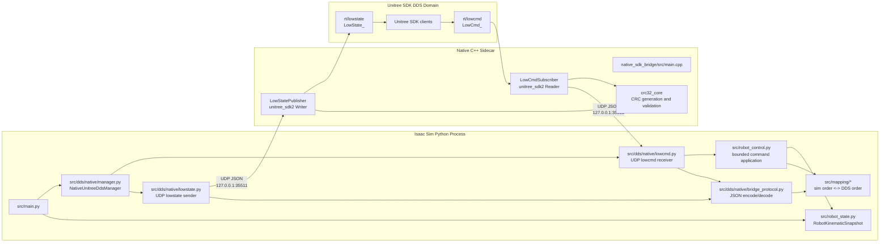
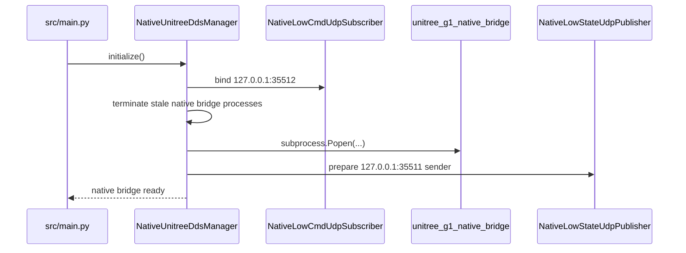
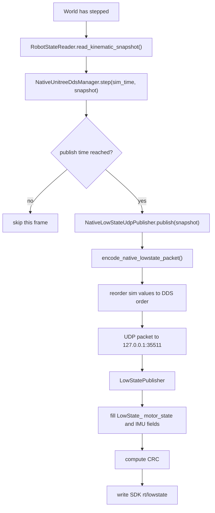
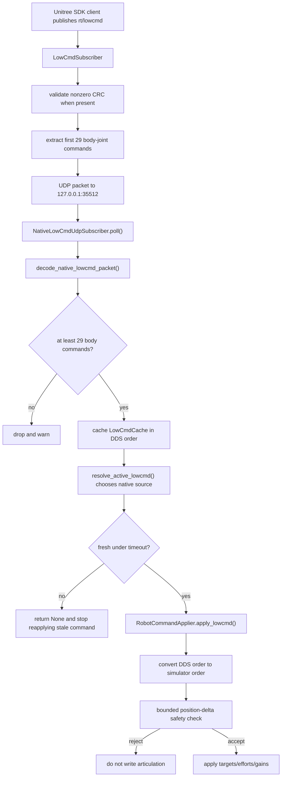

# Native Unitree SDK Bridge Context

This document is the technical map for the native Unitree SDK bridge in
`unitree_g1_isaac_sim`. It complements `context_ros2_runtime.md`, which covers
the ROS 2 sidecar path. Read this file when changing the native C++ bridge,
native lowstate publication, native lowcmd ingress, or the mixed ROS 2/native
validation flow.

## Current State

The current branch supports mixed low-level DDS operation:

- ROS 2 lowstate is enabled by default and publishes `/rt/lowstate`.
- Native Unitree SDK lowstate is enabled by default and publishes SDK
  `rt/lowstate`.
- Native Unitree SDK lowcmd is enabled by default and is the active command
  source.
- ROS 2 lowcmd command application is disabled by default.
- Startup rejects configurations where ROS 2 lowcmd and native SDK lowcmd are
  both enabled.
- Phase 3 mixed-mode validation has passed with
  `scripts/run_parallel_ros2_native_smoke_test.sh`.

This means external ROS 2 tools can keep reading the simulator through
`/rt/lowstate`, while native Unitree SDK clients can read `rt/lowstate` and
send bounded `rt/lowcmd` commands.

## Why There Are Two Bridge Paths

The ROS 2 path and native SDK path serve different consumers:

- The ROS 2 path exposes `unitree_hg/msg/LowState` and optional
  `unitree_hg/msg/LowCmd` through host ROS 2 Humble.
- The native SDK path exposes Unitree SDK2 DDS types:
  `unitree_hg::msg::dds_::LowState_` and
  `unitree_hg::msg::dds_::LowCmd_`.

The two paths intentionally remain separate because Isaac Sim, host ROS 2, and
Unitree SDK2 have different runtime and library constraints. Isaac Sim does not
link directly against Unitree SDK2. Instead, it exchanges compact localhost UDP
packets with a C++ sidecar process.

## High-Level Architecture



## Repository Layout

| Path | Responsibility |
| --- | --- |
| `src/dds/native/manager.py` | Starts/stops the native bridge process, owns native lowstate/lowcmd localhost endpoints, schedules lowstate, tracks cadence, handles stale lowcmd, and cleans stale native bridge processes. |
| `src/dds/native/lowstate.py` | Sends simulator lowstate snapshots to the native C++ sidecar over localhost UDP. |
| `src/dds/native/lowcmd.py` | Receives native lowcmd packets from the C++ sidecar over localhost UDP, validates body-joint width, and caches the latest command. |
| `src/dds/native/bridge_protocol.py` | Encodes/decodes compact JSON packets between Isaac Sim and the native sidecar. |
| `src/dds/common/lowcmd_types.py` | Shared lowcmd cache dataclasses used by ROS 2 and native command paths. |
| `src/dds/common/timing.py` | Shared lowstate cadence tracking and lowcmd freshness helpers. |
| `native_sdk_bridge/src/main.cpp` | Native bridge executable entrypoint and CLI parsing. |
| `native_sdk_bridge/src/lowstate_publisher.cpp` | Publishes Unitree SDK2 `LowState_` messages on `rt/lowstate`. |
| `native_sdk_bridge/src/lowcmd_subscriber.cpp` | Subscribes Unitree SDK2 `LowCmd_` messages on `rt/lowcmd` and forwards valid commands to Isaac. |
| `native_sdk_bridge/src/lowstate_listener_tool.cpp` | Validation tool that listens for native `LowState_` and checks CRCs. |
| `native_sdk_bridge/src/lowcmd_offset_tool.cpp` | Validation tool that seeds from native lowstate and publishes a conservative single-joint native lowcmd offset. |
| `native_sdk_bridge/include/native_sdk_bridge/*` | C++ bridge headers, including CRC utilities and protocol structures. |
| `scripts/run_parallel_ros2_native_smoke_test.sh` | Phase 3 mixed-mode external validation harness. |

## Runtime Defaults

| Setting | Default | Meaning |
| --- | --- | --- |
| `--enable-native-unitree-lowstate` | enabled | Start native SDK lowstate publication. |
| `--enable-native-unitree-lowcmd` | enabled | Start native SDK lowcmd ingress and make it the default command source. |
| `--native-unitree-domain-id` | same as `--dds-domain-id` | DDS domain used by the native SDK bridge. |
| `--native-unitree-lowstate-topic` | `rt/lowstate` | Native SDK lowstate topic. |
| `--native-unitree-lowcmd-topic` | `rt/lowcmd` | Native SDK lowcmd topic. |
| `--native-unitree-bridge-exe` | `native_sdk_bridge/build/unitree_g1_native_bridge` | Native bridge executable path. |
| native lowstate UDP | `127.0.0.1:35511` | Isaac Sim -> native sidecar lowstate packets. |
| native lowcmd UDP | `127.0.0.1:35512` | Native sidecar -> Isaac Sim lowcmd packets. |
| `--lowcmd-timeout-seconds` | `0.5` | Stop reapplying stale lowcmd samples after this interval. |
| `--lowcmd-max-position-delta-rad` | `0.25` | Reject incoming command targets too far from the current simulator pose. |

The native bridge can run on domain `1` for simulation while the real robot
remains on domain `0`.

## Startup Flow

`NativeUnitreeDdsManager.initialize()` performs the native bridge startup:

1. Skip all native setup if both native lowstate and native lowcmd are disabled.
2. Bind the Isaac-side native lowcmd UDP receiver if native lowcmd is enabled.
3. Clean up stale native bridge processes from previous simulator runs.
4. Start `unitree_g1_native_bridge` with the configured DDS domain, topics, and
   localhost ports.
5. Initialize the Isaac-side native lowstate UDP sender if native lowstate is
   enabled.
6. Log native bridge readiness.



The C++ sidecar prints readiness lines such as:

```text
native bridge starting (domain_id=1, enable_lowstate=1, enable_lowcmd=1, ...)
native lowstate publisher initialized (domain_id=1, topic=rt/lowstate, udp_host=127.0.0.1, udp_port=35511)
native lowcmd subscriber initialized (domain_id=1, topic=rt/lowcmd, udp_host=127.0.0.1, udp_port=35512)
```

## Lowstate Flow

Native lowstate moves from Isaac articulation state to SDK `rt/lowstate`.



The native C++ sidecar owns the SDK message object and CRC generation. The
Python process only sends the fields the simulator currently models:

- joint position, velocity, and estimated effort
- IMU quaternion, accelerometer, and gyroscope
- tick counter

The external validation listener verifies that native lowstate is visible and
CRC-valid.

## Lowcmd Flow

Native lowcmd moves from SDK `rt/lowcmd` to Isaac articulation commands.



The native command path shares the same `LowCmdCache` and
`RobotCommandApplier` safety logic as the ROS 2 path. The active command source
is selected in `src/main.py`; configuration preflight guarantees that ROS 2
lowcmd and native lowcmd cannot both be active.

## Topic Names Seen From ROS 2

When both ROS 2 and native paths are running, `ros2 topic list` can show both
forms:

```text
/rt/lowstate
/rt/lowcmd
/lowstate
/lowcmd
```

This is expected in mixed mode:

- `/rt/lowstate` and `/rt/lowcmd` are ROS 2 sidecar topic names.
- SDK `rt/lowstate` and SDK `rt/lowcmd` may appear through ROS 2 DDS discovery
  as `/lowstate` and `/lowcmd`.

The plain `/lowcmd` topic appearing in discovery does not mean ROS 2 lowcmd is
controlling the simulator. In the default mode, native SDK lowcmd is the active
command path and ROS 2 lowcmd command application is disabled.

## Build

Build `unitree_sdk2` first. The default expected checkout is:

```text
~/unitree_sdk2
```

Then build the bridge:

```bash
cmake -S native_sdk_bridge -B native_sdk_bridge/build
cmake --build native_sdk_bridge/build -j4
```

If `unitree_sdk2` is elsewhere:

```bash
cmake -S native_sdk_bridge -B native_sdk_bridge/build \
  -DUNITREE_SDK2_ROOT=/path/to/unitree_sdk2
cmake --build native_sdk_bridge/build -j4
```

The build outputs:

```text
native_sdk_bridge/build/unitree_g1_native_bridge
native_sdk_bridge/build/unitree_g1_native_lowstate_listener
native_sdk_bridge/build/unitree_g1_native_lowcmd_offset
```

Verify that the bridge links to Unitree SDK2's bundled CycloneDDS libraries:

```bash
ldd native_sdk_bridge/build/unitree_g1_native_bridge | grep ddsc
```

The `libddsc` and `libddscxx` paths should point under
`~/unitree_sdk2/thirdparty/lib/<arch>/`. If they resolve from `/opt/ros/humble`,
see `docs/issues.md`.

## Validation

The mixed-mode smoke test is the main external validation:

```bash
DDS_DOMAIN_ID=1 ./scripts/run_parallel_ros2_native_smoke_test.sh
```

It launches Isaac Sim and checks:

- ROS 2 `/rt/lowstate` receives valid samples.
- Native SDK `rt/lowstate` receives CRC-valid samples.
- Native SDK `rt/lowcmd` publishes a conservative bounded offset command.
- ROS 2 lowcmd remains disabled in the target command-authority mode.

Successful output ends with:

```text
RESULT: mixed ROS2/native DDS smoke test passed
```

Logs are written to:

```text
tmp/parallel_ros2_native_smoke_logs/
```

## Known Constraints

- The native lowstate message includes the modeled simulator fields, not every
  hardware-only Unitree field.
- The command application is intentionally conservative and bounded; large
  position jumps are rejected before articulation writes.
- CRC validation accepts zero CRC for compatibility, but rejects invalid
  nonzero CRCs.
- The native sidecar process must link against Unitree SDK2's CycloneDDS
  libraries, not ROS 2's CycloneDDS libraries.
- Startup cleanup handles stale native bridge processes from previous runs, but
  a hard-killed Isaac session can still leave external DDS discovery state
  visible briefly until the middleware times out.
