# Unitree G1 Isaac Sim System Context

This document is the in-depth technical map for the `feat/ros2` branch of
`unitree_g1_isaac_sim`. It explains how the simulator starts, how robot state
is extracted, how low-level command and state traffic crosses the ROS 2 /
CycloneDDS boundary, how the DDS bridge is structured, and how the simulated
Livox MID360 path fits into the overall runtime.

Current branch note: the default command-authority mode has changed since this
document was first written. ROS 2 lowstate remains enabled by default, but ROS 2
lowcmd command application is disabled by default and native Unitree SDK
`rt/lowcmd` is the active command source. The native bridge is documented in
`context_native_bridge.md`.

The shorter user-facing launch notes remain in `README.md`. This file is meant
to be the architecture reference you read when changing or debugging the
system.

## What This Repository Does

The repository runs a Unitree G1 robot in Isaac Sim and exposes enough of the
real robot's low-level ROS 2 / CycloneDDS surface for external ROS 2 clients to
treat the simulator like a robot endpoint.

The current branch has three major runtime surfaces:

- G1 articulation simulation in Isaac Sim.
- Low-level robot bridge for `/rt/lowstate` and `/rt/lowcmd`.
- Simulated Livox MID360 point cloud publication on `/livox/lidar`.

The low-level bridge is not a direct in-process `unitree_sdk2py` DDS bridge on
this branch. Instead, Isaac Sim communicates with a system-Python ROS 2 sidecar
over localhost UDP. The sidecar publishes and subscribes `unitree_hg` ROS 2
messages through CycloneDDS.

## High-Level Architecture

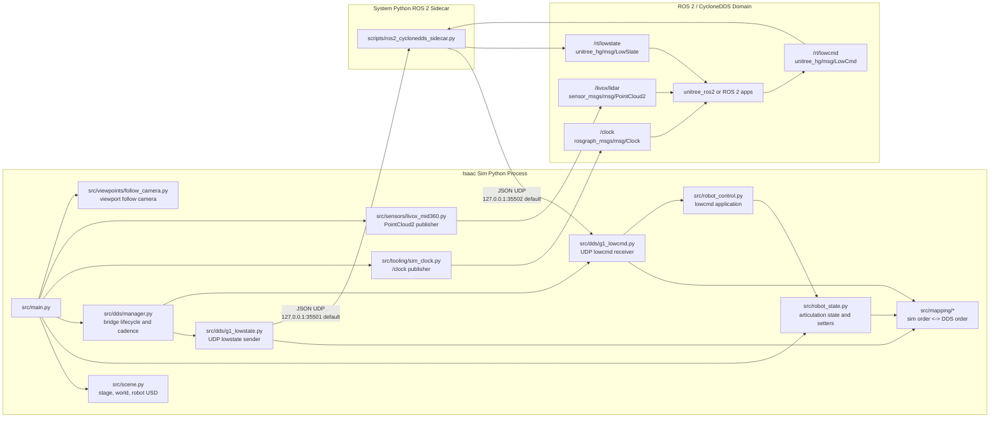

## Repository Layout

| Path | Responsibility |
| --- | --- |
| `src/main.py` | Standalone Isaac Sim entrypoint. Owns application startup, scene construction, world reset, state-reader initialization, bridge setup, and the main simulation loop. |
| `src/config.py` | Runtime configuration, CLI argument parsing, asset/world path resolution, ROS 2 sidecar settings, publish-rate validation, LiDAR settings, and camera settings. |
| `src/scene.py` | Creates `/World`, physics scene, gravity, ground plane or optional world USD, light, and references the G1 USD asset. |
| `src/robot_state.py` | Wraps Isaac's `Articulation`, reads joint/base/IMU-like state, validates physics-view liveness, applies joint targets, efforts, and gains. |
| `src/robot_control.py` | Applies cached low-level commands to the articulation after DDS-to-simulator joint-order conversion and bounded-motion safety checks. |
| `src/mapping/*` | Freezes the 29-DoF simulator joint order, freezes the DDS body-joint order, validates live order, and converts vectors between both orders. |
| `src/dds/manager.py` | Owns bridge lifecycle, sidecar process startup/shutdown, lowstate cadence scheduling, stale-lowcmd handling, and reset cleanup. |
| `src/dds/bridge_protocol.py` | JSON packet encoding/decoding between Isaac Sim and the sidecar. |
| `src/dds/g1_lowstate.py` | Sends DDS-ordered lowstate JSON packets from Isaac Sim to the sidecar over UDP. |
| `src/dds/g1_lowcmd.py` | Receives lowcmd JSON packets from the sidecar over UDP, validates width, caches the latest command, and exposes simulator-order conversion. |
| `scripts/ros2_cyclonedds_sidecar.py` | System-Python ROS 2 node. Publishes `LowState`, subscribes `LowCmd`, and translates both to/from localhost UDP packets. |
| `src/tooling/sim_clock.py` | Publishes `/clock` from Isaac simulation time using Isaac's ROS 2 bridge-compatible environment. |
| `src/sensors/livox_mid360.py` | Mounts a MID360-like frame under the G1 torso, performs PhysX raycasts, and publishes `PointCloud2`. |
| `src/ros2_runtime/environment.py` | Prepares Isaac's ROS 2 bridge environment by setting CycloneDDS variables and filtering incompatible ROS Python paths. |
| `src/viewpoints/follow_camera.py` | Creates and updates a follow camera aimed at the robot base. |
| `scripts/lowstate_listener.py` | External validation helper for observing `/rt/lowstate`. |
| `scripts/send_lowcmd_offset.py` | External validation helper for sending a conservative single-joint `/rt/lowcmd` offset. |
| `scripts/run_dds_smoke_test.sh` | End-to-end lowstate/lowcmd smoke test harness. |
| `scripts/run_full_validation.sh` | Broader validation harness for unit tests, startup determinism, bridge behavior, command tracking, reset, and cadence checks. |
| `Models/USD/*` | G1 23-DoF and 29-DoF USD robot assets. The 29-DoF path is the validated runtime path. |
| `Models/world/Hospital_World.usd` | Optional world asset loaded when `--use-world true` is set. |

## Runtime Entry Point

The simulator is launched with Isaac Sim's Python runner:

```bash
isaac_sim_python src/main.py --headless
```

`src/main.py` calls `parse_config()`, starts `SimulationApp`, builds the stage,
creates ROS-facing publishers, creates and resets the Isaac `World`, initializes
the G1 articulation reader, starts the DDS/ROS 2 sidecar bridge, then enters the
main loop.

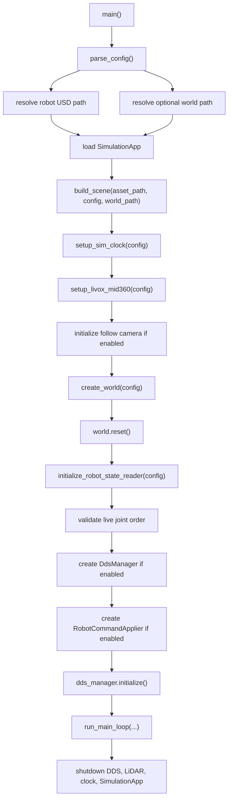

## Configuration Model

`AppConfig` in `src/config.py` is the single runtime configuration object. It is
constructed from CLI arguments and includes:

- robot asset selection and prim path
- optional world loading
- physics timestep and render/headless settings
- deterministic reset settings
- lowstate/lowcmd bridge topics and localhost ports
- ROS 2 domain and sidecar Python executable
- lowcmd bounded-motion limit
- lowstate cadence diagnostics
- Livox MID360 simulation settings
- follow camera settings

Important defaults on this branch:

| Setting | Default | Meaning |
| --- | --- | --- |
| `--robot-variant` | `29dof` | Validated G1 asset variant. |
| `--robot-prim-path` | `/World/G1` | Where the robot USD is referenced. |
| `--physics-dt` | `0.002` | 500 Hz physics loop. |
| `--enable-dds` | enabled | Starts the ROS 2 sidecar bridge by default. |
| `--enable-lowcmd-subscriber` | enabled | Accepts `/rt/lowcmd` by default. |
| `--lowstate-publish-hz` | `500.0` | Lowstate target rate. Cannot exceed physics rate. |
| `--dds-domain-id` | `1` | ROS 2 / CycloneDDS domain. |
| `--bridge-bind-host` | `127.0.0.1` | Local UDP interface between Isaac and sidecar. |
| `--bridge-lowstate-port` | `35501` | Isaac -> sidecar lowstate UDP port. |
| `--bridge-lowcmd-port` | `35502` | Sidecar -> Isaac lowcmd UDP port. |
| `--lowcmd-max-position-delta-rad` | `0.25` | Rejects large posture jumps. Use `0` to disable. |
| `--enable-livox-lidar` | enabled | Creates the simulated MID360 path. |
| `--livox-lidar-topic` | `livox/lidar` | Publishes as `/livox/lidar`. |
| `--enable-follow-camera` | enabled | Keeps the active viewport camera following the robot. |
| `--use-world` | `false` | Uses ground plane unless explicitly enabled. |

`parse_config()` also enforces that `--lowstate-publish-hz` is not higher than
the physics rate derived from `--physics-dt`.

## Scene Construction

`src/scene.py` owns only stage construction. It does not initialize robot state
or DDS.

The scene setup sequence is:

1. Create a new USD stage.
2. Set the stage up-axis to Z and meters-per-unit to 1.0.
3. Define `/World` as the default prim.
4. Define `/World/PhysicsScene` with Earth gravity.
5. Create a `PhysicsContext` using `config.physics_dt`.
6. Enable PhysX scene query support when the Livox path is enabled.
7. Create a ground plane unless a world USD is requested.
8. Add a distant light.
9. Reference the selected G1 USD at `config.robot_prim_path`.
10. Translate the robot root to `config.robot_height`.

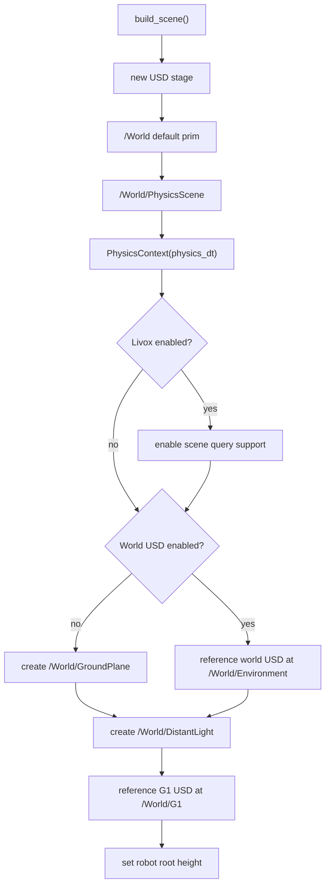

## Robot State Boundary

`RobotStateReader` in `src/robot_state.py` is the only direct articulation
wrapper. It centralizes Isaac Sim version compatibility and keeps articulation
assumptions out of DDS and control modules.

It provides:

- `initialize()`
- `reinitialize_after_world_reset()`
- deterministic startup/reset state application
- joint state reads
- kinematic snapshot reads
- joint target, velocity, effort, and gain application
- physics-view liveness checks

The primary data object for bridge publication is `RobotKinematicSnapshot`.

It contains:

- `joint_names`
- `joint_positions`
- `joint_velocities`
- `joint_efforts`
- `base_position_world`
- `base_quaternion_wxyz`
- `base_linear_velocity_world`
- `base_angular_velocity_world`
- `imu_linear_acceleration_body`
- `imu_angular_velocity_body`

The internal quaternion convention is `wxyz`, matching the validated Isaac
`get_world_poses()` path in this codebase.

### IMU Emulation

The IMU-like linear acceleration is a proper-acceleration estimate:

- world gravity is treated as `[0, 0, -9.81]`
- a stationary upright robot reports approximately `[0, 0, +9.81]` in body
  frame
- dynamic acceleration is finite-differenced from simulator linear velocity
  using simulation `dt`, not wall time
- angular velocity is rotated from world frame into body frame

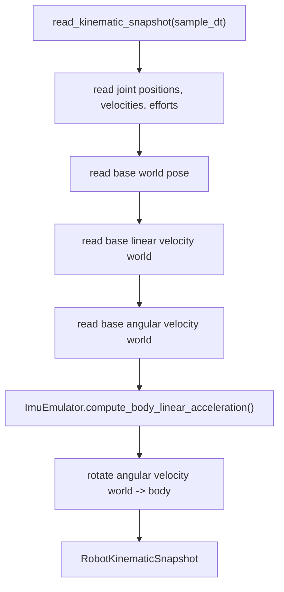

## Joint-Order Mapping

The simulator articulation order and the external DDS body-joint order are not
the same. The mapping layer freezes both orders and forces every boundary to
use explicit conversion helpers.

`src/mapping/joints.py` defines:

- `SIM_G1_29DOF_JOINT_NAMES`
- `DDS_G1_29DOF_JOINT_NAMES`
- `BODY_JOINT_COUNT = 29`
- `G1_29DOF_JOINT_MAPPING`

`src/mapping/conversion.py` provides:

- `reorder_sim_values_to_dds(values)`
- `reorder_dds_values_to_sim(values)`
- `to_dds_ordered_snapshot(snapshot)`

`src/mapping/validator.py` validates that the live Isaac articulation still
matches the frozen simulator order at startup. If the USD asset changes and the
joint order drifts, startup fails before DDS state or commands can silently use
wrong indices.

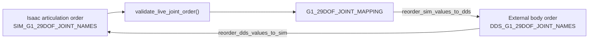

The simulator order starts:

```text
0  left_hip_pitch_joint
1  right_hip_pitch_joint
2  waist_yaw_joint
3  left_hip_roll_joint
4  right_hip_roll_joint
...
```

The DDS order starts:

```text
0  left_hip_pitch_joint
1  left_hip_roll_joint
2  left_hip_yaw_joint
3  left_knee_joint
4  left_ankle_pitch_joint
...
```

This difference is why all lowstate publication and lowcmd ingestion must route
through the mapping helpers.

## Main Simulation Loop

`run_main_loop()` is intentionally linear. It performs command application
before stepping physics, then publishes state after the new frame exists.

Per frame:

1. If DDS and command application are enabled, ask `DdsManager.latest_lowcmd`
   for the latest fresh command and apply it.
2. Step Isaac `World`.
3. Advance local simulation time by `physics_dt`.
4. Optionally trigger a deterministic in-session reset.
5. Publish `/clock`.
6. Step the Livox publisher.
7. Read a kinematic snapshot if DDS or camera needs it.
8. Update the follow camera from the snapshot.
9. Step the DDS manager with the snapshot.
10. Stop if `--max-frames` was reached.

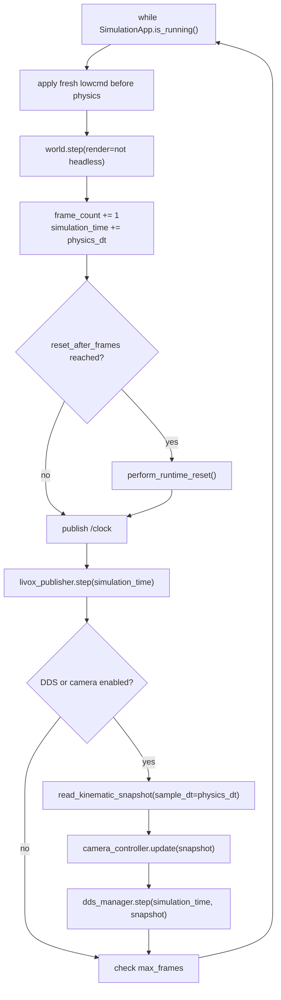

## DDS Bridge Design

On this branch, the "DDS bridge" is a two-process bridge:

- Isaac Sim process handles simulation, state extraction, safety checks, and
  articulation writes.
- System-Python sidecar handles `rclpy`, `unitree_hg`, and CycloneDDS.

This split exists because Isaac Sim's Python runtime and the host ROS 2 Humble
Python runtime can be incompatible. The localhost UDP protocol keeps the
boundary simple and avoids importing host ROS 2 packages directly into Isaac's
Python process.

### Bridge Components

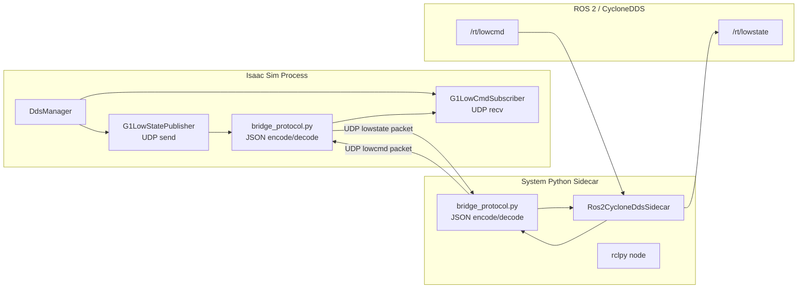

### Sidecar Startup

`DdsManager.initialize()`:

1. Checks `config.enable_dds`.
2. Requires `config.unitree_ros2_install_prefix`.
3. Initializes the lowcmd UDP receiver first so the sidecar knows the actual
   destination port. If the requested port is busy, it falls back to an
   ephemeral localhost port.
4. Cleans up stale `ros2_cyclonedds_sidecar.py` processes from prior runs.
5. Starts the sidecar with `bash -lc`, sourcing:
   - `/opt/ros/humble/setup.bash`
   - `<unitree_ros2 install prefix>/setup.bash`
6. Sets:
   - `RMW_IMPLEMENTATION=rmw_cyclonedds_cpp`
   - `ROS_DOMAIN_ID=<dds_domain_id>`
7. Initializes the lowstate UDP sender.

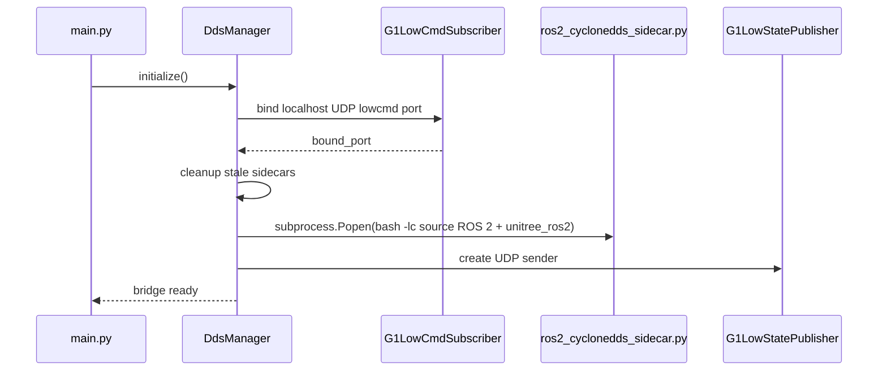

### Localhost Packet Protocol

`src/dds/bridge_protocol.py` uses compact JSON packets.

Lowstate packet fields:

- `tick`
- `joint_positions`
- `joint_velocities`
- `joint_efforts`
- `imu_quaternion_wxyz`
- `imu_accelerometer`
- `imu_gyroscope`

Lowcmd packet fields:

- `mode_pr`
- `mode_machine`
- `joint_positions_dds`
- `joint_velocities_dds`
- `joint_torques_dds`
- `joint_kp_dds`
- `joint_kd_dds`

The packet protocol is localhost-only and intentionally narrow. It is not a
general network protocol, and it does not attempt to preserve every Unitree
message field.

## Lowstate Flow

Lowstate moves from Isaac articulation state to ROS 2 `/rt/lowstate`.

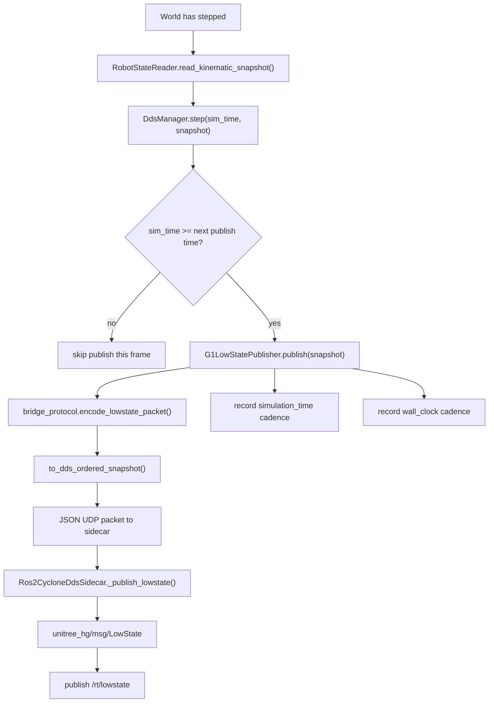

Cadence scheduling is based on simulation time. The next publish target is
advanced from the prior target, not re-anchored to the current frame. This
keeps the effective rate aligned when physics `dt` and publish period are not
exact multiples.

The sidecar fills:

- `message.version = [1, 0]`
- `message.tick`
- `message.imu_state.quaternion`
- `message.imu_state.accelerometer`
- `message.imu_state.gyroscope`
- first 29 `message.motor_state` entries

It sets `message.crc = 0` in the ROS 2 message path.

## Lowcmd Flow

Lowcmd moves from ROS 2 `/rt/lowcmd` to Isaac articulation commands.

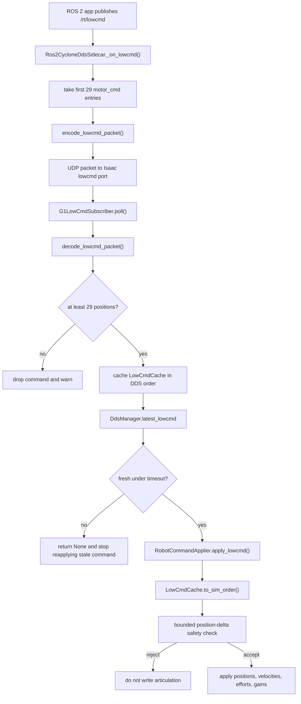

Important safety and freshness behavior:

- `--enable-lowcmd-subscriber` can disable command ingestion.
- A cached command is considered stale after `--lowcmd-timeout-seconds`.
- If the timeout is `0`, cached commands never expire.
- `--lowcmd-max-position-delta-rad` rejects large position jumps relative to
  the current simulator pose.
- A delta limit of `0` disables bounded-motion rejection.
- Incoming command vectors are stored in DDS order and converted to simulator
  order only at application time.

The command applier attempts to forward:

- joint position targets
- joint velocity targets
- joint efforts
- `kp` and `kd` gains

Actual application depends on which articulation setter APIs are available in
the Isaac Sim runtime.

## DdsManager Runtime Responsibilities

`DdsManager` is the bridge coordinator. It owns:

- sidecar process lifecycle
- stale sidecar cleanup
- lowstate UDP sender
- lowcmd UDP receiver
- lowstate schedule
- simulation-time cadence diagnostics
- wall-clock cadence diagnostics
- stale lowcmd detection
- bridge reset cleanup

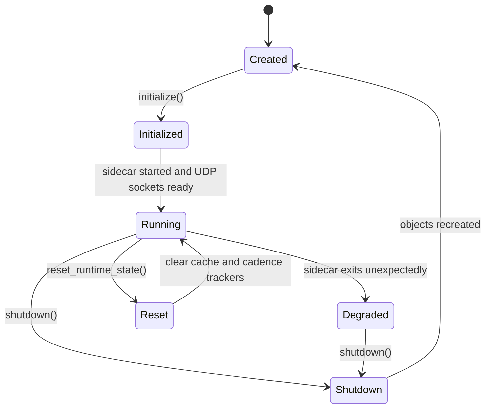

If the sidecar process exits while `_sdk_enabled` is true, `_poll_sidecar_health`
logs an error and disables bridge publication/ingestion until restart logic is
added or the simulator is relaunched.

## ROS 2 Sidecar

`scripts/ros2_cyclonedds_sidecar.py` is the process that actually touches host
ROS 2 Humble and `unitree_hg`.

It creates one node:

```text
unitree_g1_ros2_sidecar
```

The node:

- publishes `unitree_hg/msg/LowState` to `lowstate_topic`
- subscribes `unitree_hg/msg/LowCmd` from `lowcmd_topic`
- receives Isaac lowstate JSON packets on the lowstate UDP port
- sends Isaac lowcmd JSON packets to the lowcmd UDP port

Its main loop alternates:

```text
rclpy.spin_once(node, timeout_sec=0.01)
node.poll_once()
```

That means ROS callbacks and UDP lowstate publication happen in the same simple
sidecar loop.

## ROS 2 Bridge Runtime Helpers

`src/ros2_runtime/environment.py` prepares Isaac-native ROS 2 publishers such as
`/clock` and `/livox/lidar`.

It:

- finds Isaac's Humble ROS 2 bridge library directory if available
- prepends that directory to `LD_LIBRARY_PATH`
- sets `ROS_DISTRO=humble`
- sets `RMW_IMPLEMENTATION=rmw_cyclonedds_cpp`
- sets `ROS_DOMAIN_ID`
- removes incompatible ROS Python 3.10 paths from `PYTHONPATH` and `sys.path`
- enables `isaacsim.ros2.bridge`

This is separate from the sidecar. The sidecar uses host ROS 2. Isaac-native
publishers use Isaac's Python environment after path cleanup.

## Simulated Clock

`src/tooling/sim_clock.py` publishes `/clock` from Isaac simulation time.

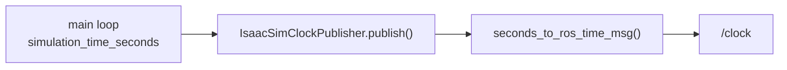

The stamp is generated from the same simulation-time counter that drives the
main loop and lowstate scheduler.

## Simulated Livox MID360

The Livox path is independent from the lowstate/lowcmd sidecar. It publishes
`sensor_msgs/msg/PointCloud2` directly from inside Isaac through a ROS 2 node.

`setup_livox_mid360(config)`:

1. Prepares Isaac's ROS 2 bridge environment.
2. Enables `isaacsim.sensors.rtx`.
3. Enables `isaacsim.ros2.bridge`.
4. Finds the parent USD prim named `torso_link` under the robot.
5. Creates a `mid360_link` frame using the URDF-matched fixed transform.
6. Creates an RTX LiDAR prim under that frame.
7. Creates a direct ROS 2 `PointCloud2` publisher.

The current live point-cloud data path uses PhysX raycasts. The code comments
state that Isaac Sim 5.1's RTX/Replicator writer path failed in this
environment while setting OmniGraph array attributes, so this branch uses
raycasts as the practical runtime path.

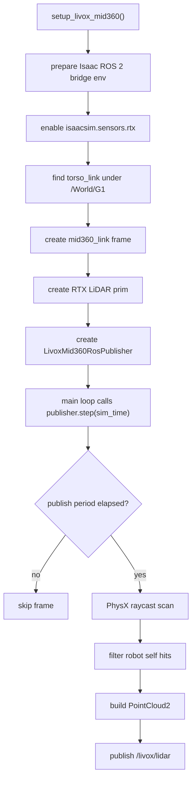

MID360 defaults:

| Field | Default |
| --- | --- |
| Parent link | `torso_link` |
| Sensor frame | `mid360_link` |
| ROS topic | `/livox/lidar` |
| ROS frame id | `mid360_link` |
| Frame rate | `10 Hz` |
| Point rate | `200,000 points/s` |
| Points per scan | `20,000` |
| Channels | `40` |
| Near range | `0.1 m` |
| Far range | `40.0 m` |

The MID360 transform mirrors the robot URDF:

```text
translation: (0.0002835, 0.00003, 0.40618)
rpy:         (0, 0.04014257279586953, 0)
parent:      torso_link
child:       mid360_link
```

## Follow Camera

The follow camera is optional and enabled by default. It creates a camera prim
at `config.follow_camera_prim_path`, makes it the active viewport camera, and
updates it from the robot base pose.

The camera yaw is derived from the robot base quaternion in `wxyz` order. The
camera is placed behind the robot heading:

```text
eye = base - heading * follow_camera_distance + z * follow_camera_height
target = base + z * follow_camera_target_height
```

Disable it with:

```bash
isaac_sim_python src/main.py --no-enable-follow-camera
```

## Deterministic Startup And Reset

Startup applies a canonical zeroed articulation state before the first
DDS-visible sample:

- joint positions set to zero when supported
- joint velocities set to zero when supported
- joint efforts set to zero when supported
- IMU finite-difference history cleared

Runtime reset is available through `--reset-after-frames`.

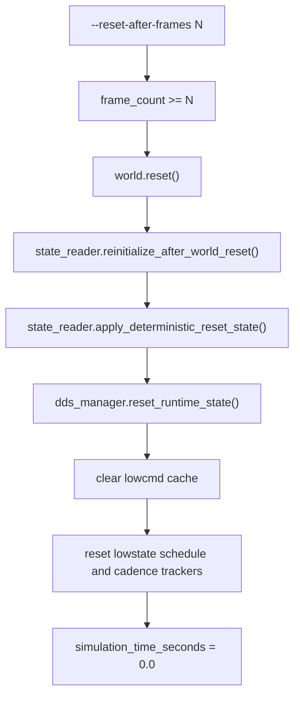

## Runtime Topics

Expected ROS 2 topics when running the default branch configuration:

| Topic | Direction | Message | Producer |
| --- | --- | --- | --- |
| `/rt/lowstate` | simulator -> ROS 2 | `unitree_hg/msg/LowState` | sidecar from Isaac UDP packets |
| `/rt/lowcmd` | ROS 2 -> simulator | `unitree_hg/msg/LowCmd` | external ROS 2 apps, consumed by sidecar |
| `/clock` | simulator -> ROS 2 | `rosgraph_msgs/msg/Clock` | Isaac native publisher |
| `/livox/lidar` | simulator -> ROS 2 | `sensor_msgs/msg/PointCloud2` | Isaac native publisher |

## Launch And Verification

Launch the simulator:

```bash
isaac_sim_python src/main.py --headless
```

Launch with the optional world:

```bash
isaac_sim_python src/main.py --headless --use-world true
```

Launch without the LiDAR:

```bash
isaac_sim_python src/main.py --headless --no-enable-livox-lidar
```

Launch with an explicit Unitree ROS 2 install prefix:

```bash
isaac_sim_python src/main.py \
  --headless \
  --unitree-ros2-install-prefix ~/Workspaces/unitree_ros2/cyclonedds_ws/install
```

In another terminal:

```bash
source /opt/ros/humble/setup.bash
source ~/Workspaces/unitree_ros2/cyclonedds_ws/install/setup.bash
export RMW_IMPLEMENTATION=rmw_cyclonedds_cpp
export ROS_DOMAIN_ID=1
```

List topics:

```bash
ros2 topic list
```

Inspect lowstate once:

```bash
ros2 topic echo /rt/lowstate --once
```

Check lowstate rate:

```bash
ros2 topic hz /rt/lowstate
```

Inspect LiDAR:

```bash
ros2 topic info /livox/lidar
ros2 topic echo /livox/lidar --once
```

Publish a minimal lowcmd:

```bash
ros2 topic pub --once /rt/lowcmd unitree_hg/msg/LowCmd "{mode_pr: 0, mode_machine: 0}"
```

## Validation Harnesses

### DDS Smoke Test

```bash
./scripts/run_dds_smoke_test.sh
```

The smoke test:

- starts Isaac Sim headless
- waits for sidecar and lowcmd/lowstate readiness markers
- runs a lowstate listener
- sends a conservative lowcmd offset
- verifies expected log markers
- writes logs under `tmp/dds_smoke_logs/`

Useful environment overrides:

```bash
DDS_DOMAIN_ID=1
SIM_STARTUP_TIMEOUT_SECONDS=90
LOWSTATE_DURATION_SECONDS=6
LOWCMD_DURATION_SECONDS=2
LOWCMD_JOINT_NAME=left_shoulder_pitch_joint
LOWCMD_OFFSET_RAD=0.10
```

### Full Validation

```bash
./scripts/run_full_validation.sh
```

The full validation harness runs:

- unit tests
- deterministic startup checks across two launches
- DDS smoke test
- command tracking and stale-timeout validation
- in-session deterministic reset validation
- long-run lowstate cadence validation

It writes logs under `tmp/full_validation_logs/`.

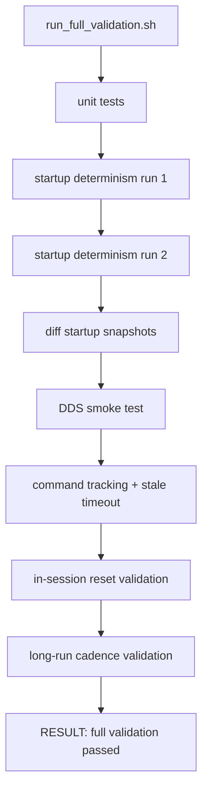

## Unit Tests

The branch includes focused tests for:

- config validation
- DDS manager cadence, stale lowcmd, reset cleanup, sidecar behavior
- lowcmd packet ingestion and width handling
- bridge protocol encoding/decoding
- robot command application and safety rejection
- robot-state pause/physics-view handling
- lowstate listener behavior
- Livox MID360 setup and scan helpers

Run the unit tests with:

```bash
python3 -m unittest discover tests
```

Some tests mock Isaac or ROS-facing pieces, but full simulator validation still
requires Isaac Sim and the ROS 2 environment.

## Failure Modes And Debugging

### No `/rt/lowstate`

Check:

- `--enable-dds` was not disabled
- `UNITREE_ROS2_INSTALL_PREFIX` or `--unitree-ros2-install-prefix` points to a
  built `unitree_ros2/cyclonedds_ws/install`
- `ROS_DOMAIN_ID` matches `--dds-domain-id`
- the sidecar did not exit unexpectedly
- `RMW_IMPLEMENTATION=rmw_cyclonedds_cpp` is set in the ROS 2 terminal

### Lowcmd Does Not Move The Robot

Check:

- `/rt/lowcmd` is published in the same ROS 2 domain
- `--enable-lowcmd-subscriber` was not disabled
- command has at least 29 motor slots
- command is not stale under `--lowcmd-timeout-seconds`
- target positions are within `--lowcmd-max-position-delta-rad`
- the articulation physics view is available

### Lowstate Rate Is Lower Than Target

There are three useful rate views:

- simulation-time cadence log from `DdsManager`
- wall-clock cadence log from `DdsManager`
- external `ros2 topic hz /rt/lowstate`

The configured default target is 500 Hz. The README notes that observed
end-to-end ROS 2 rate has been about 467-470 Hz and is currently accepted on
this branch when it remains above 450 Hz.

### No `/livox/lidar`

Check:

- `--enable-livox-lidar` was not disabled
- Isaac ROS 2 bridge environment was prepared
- `torso_link` exists under the robot USD prim
- `ROS_DOMAIN_ID` matches the viewer/listener terminal
- the scene has collision geometry for PhysX raycasts to hit
- if running with only a ground plane, wait until scans hit non-robot geometry

### Sidecar Port Collision

If the configured lowcmd UDP port is already in use, `G1LowCmdSubscriber`
falls back to an ephemeral localhost port and passes that actual port to the
sidecar. Lowstate still uses the configured lowstate port.

## Design Boundaries

The current branch intentionally keeps these boundaries:

- Isaac Sim owns physics, articulation state, safety checks, and command
  application.
- The sidecar owns host ROS 2 Humble and `unitree_hg` message I/O.
- The JSON UDP bridge is local implementation plumbing, not the public API.
- The public API is the ROS 2 / CycloneDDS topic surface.
- Joint-order conversion is centralized under `src/mapping`.
- LiDAR and clock use Isaac-native ROS 2 publication and do not go through the
  lowstate/lowcmd sidecar.

## Current Limitations

- The 29-DoF G1 asset is the validated path. The 23-DoF asset exists but is not
  the primary validated bridge target.
- The localhost JSON bridge preserves only the fields needed by the current
  lowstate/lowcmd path.
- ROS 2 `LowState.crc` is currently set to `0` by the sidecar.
- Lowcmd safety is a simple max position-delta guard, not a full dynamics or
  collision-safety controller.
- The MID360 model is a practical simulation approximation, not an official
  Livox calibration model.
- Sidecar failure disables bridge I/O for the run; automatic sidecar restart is
  not implemented.

## Mental Model For Changes

When adding or modifying behavior, keep the data ownership clear:

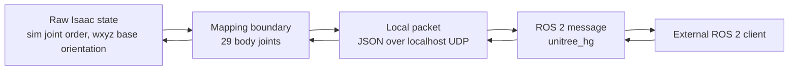

If a field crosses from Isaac to ROS 2 or from ROS 2 to Isaac, ask:

1. What frame convention is it in?
2. What joint order is it in?
3. Is it simulation time or wall time?
4. Does it belong in the lowstate/lowcmd sidecar, or should it be an
   Isaac-native ROS 2 publisher like LiDAR and `/clock`?
5. Does it need reset cleanup or stale-data handling?
