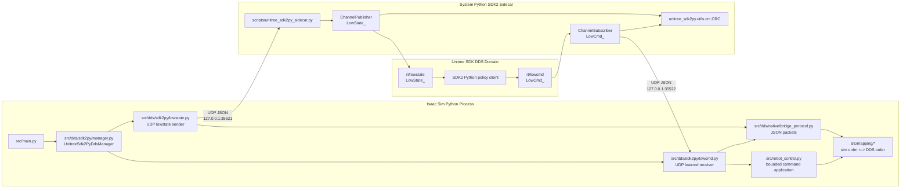

# Unitree SDK2 Python Runtime Context

This document describes the SDK2 Python runtime path used by the simulator for
policy-facing Unitree DDS I/O. Read it when changing `src/dds/sdk2py/`,
`scripts/unitree_sdk2py_sidecar.py`, SDK2 Python validation tooling, or default
runtime selection in `src/main.py`.

## Current State

The default launch mode is ROS 2 observation plus SDK2 Python control:

```bash
isaac_sim_python src/main.py --headless
```

Default behavior:

- ROS 2 `/rt/lowstate` is published for observation.
- ROS 2 `/rt/lowcmd` is disabled and hidden.
- SDK2 Python `rt/lowstate` is published for policy clients.
- SDK2 Python `rt/lowcmd` is the active command authority.
- Native C++ Unitree SDK runtime is disabled.

The native C++ SDK runtime remains available, but it is mutually exclusive with
SDK2 Python. To use native C++ SDK mode, disable both SDK2 Python lowstate and
lowcmd before enabling native lowstate or lowcmd.

## Architecture



SDK2 Python runs in a system-Python sidecar instead of inside Isaac Sim. This
avoids Python runtime and shared-library conflicts between Isaac's embedded
Python and the host SDK2 Python install.

## Runtime Selection

`src/main.py` resolves runtime mode before creating managers:

- `DdsManager` starts when ROS 2 lowstate or explicit ROS 2 lowcmd is enabled.
- `UnitreeSdk2PyDdsManager` starts when SDK2 Python lowstate or lowcmd is
  enabled.
- `NativeUnitreeDdsManager` starts only when native lowstate or lowcmd is
  enabled and SDK2 Python runtime is inactive.

Configuration preflight in `src/config.py` rejects:

- ROS 2 lowcmd plus SDK2 Python lowcmd.
- ROS 2 lowcmd plus native C++ SDK lowcmd.
- native C++ SDK lowcmd plus SDK2 Python lowcmd.
- native C++ SDK runtime plus SDK2 Python runtime.

The active command source is resolved in `resolve_active_lowcmd(...)` in this
order:

1. SDK2 Python.
2. native C++ SDK.
3. ROS 2.

Preflight guarantees that only one source can be active in a valid launch.

## Important Flags

| Flag | Default | Meaning |
| --- | --- | --- |
| `--enable-unitree-sdk2py-lowstate` | `true` | Publish SDK2 Python `rt/lowstate`. |
| `--enable-unitree-sdk2py-lowcmd` | `true` | Accept SDK2 Python `rt/lowcmd` as command authority. |
| `--unitree-sdk2py-domain-id` | `--dds-domain-id` | DDS domain used by SDK2 Python sidecar. |
| `--unitree-sdk2py-lowstate-topic` | `rt/lowstate` | SDK2 Python lowstate topic. |
| `--unitree-sdk2py-lowcmd-topic` | `rt/lowcmd` | SDK2 Python lowcmd topic. |
| `--unitree-sdk2py-network-interface` | `lo` | Network interface passed to SDK2 Python channel init. |
| `--lowcmd-timeout-seconds` | `0.5` | Freshness window before cached lowcmd is dropped. |
| `--lowcmd-max-position-delta-rad` | `0.25` | Rejects unsafe posture jumps before articulation writes. |

## Validation

Run the SDK2 Python policy smoke test:

```bash
./scripts/run_sdk2py_policy_smoke_test.sh
```

The script verifies:

- startup hygiene completes before launch
- ROS 2 `/rt/lowstate` is visible
- ROS 2 `/rt/lowcmd` is hidden
- SDK2 Python `rt/lowstate` is visible to `scripts/sdk2py_lowstate_listener.py`
- SDK2 Python `rt/lowcmd` reaches the simulator through
  `scripts/sdk2py_send_lowcmd_offset.py`
- native C++ SDK lowstate and lowcmd are not started

Successful output ends with:

```text
RESULT: SDK2 Python policy smoke test passed
```

Logs are written to:

```text
tmp/sdk2py_policy_smoke_logs/
```

## Manual Checks

Listen to SDK2 Python lowstate:

```bash
python3 scripts/sdk2py_lowstate_listener.py \
  --dds-domain-id 1 \
  --network-interface lo \
  --duration 5
```

Send a conservative SDK2 Python lowcmd offset:

```bash
python3 scripts/sdk2py_send_lowcmd_offset.py \
  --dds-domain-id 1 \
  --network-interface lo \
  --joint-name left_shoulder_pitch_joint \
  --offset-rad 0.05 \
  --duration 1
```

The offset sender is a transport smoke-test tool. It is not a locomotion policy
and does not keep the humanoid balanced.

## Troubleshooting

### Missing `unitree_sdk2py`

Symptom:

```text
Failed to import Unitree SDK2 Python ... No module named 'unitree_sdk2py'
```

Fix:

- Install the Python SDK or keep the checkout at `~/unitree_sdk2_python`.
- Run helper scripts with system Python, not Isaac Sim Python.
- Confirm:

```bash
python3 -c "import unitree_sdk2py; print(unitree_sdk2py.__file__)"
```

### Missing CRC Shared Library

Symptoms can include import failures from `unitree_sdk2py.utils.crc` or runtime
errors mentioning the SDK CRC library.

Fix:

- Verify the SDK checkout/install includes the packaged CRC shared library.
- Reinstall or rebuild `unitree_sdk2py` using the SDK instructions.
- Keep the SDK path available to the sidecar through the default
  `~/unitree_sdk2_python` location or `PYTHONPATH`.

### DDS Domain Mismatch

Symptoms:

- ROS 2 `/rt/lowstate` is visible but SDK2 Python listener receives no samples.
- SDK2 Python sender publishes, but simulator does not react.

Fix:

- Use the same domain for simulator and SDK2 Python tools:

```bash
isaac_sim_python src/main.py --headless --dds-domain-id 1 --unitree-sdk2py-domain-id 1
python3 scripts/sdk2py_lowstate_listener.py --dds-domain-id 1
```

- Keep the real robot on domain `0`; use domain `1` for simulator testing.

### Network Interface Mismatch

The default SDK2 Python network interface is `lo`. If a policy runs on another
host or interface, pass the same interface to the simulator and tools:

```bash
isaac_sim_python src/main.py --headless --unitree-sdk2py-network-interface eth0
python3 scripts/sdk2py_lowstate_listener.py --network-interface eth0
```

Use `--network-interface none` only for helper scripts that should omit the
interface argument to `ChannelFactoryInitialize`.

### Accidental Native C++ Bridge Activation

Default SDK2 Python mode should not start native bridge logs such as:

```text
native lowstate publisher initialized
native lowcmd subscriber initialized
```

If those appear, check launch flags. Native mode requires SDK2 Python runtime
to be disabled:

```bash
isaac_sim_python src/main.py \
  --headless \
  --no-enable-unitree-sdk2py-lowstate \
  --no-enable-unitree-sdk2py-lowcmd \
  --enable-native-unitree-lowstate \
  --enable-native-unitree-lowcmd
```

### Stale Discovery Or Sidecar Processes

Normal `Ctrl+C` shutdown runs manager cleanup. Hard-killed Isaac sessions can
still leave DDS discovery state or sidecar processes briefly visible.

Use the Phase 4 smoke test for conservative startup hygiene:

```bash
./scripts/run_sdk2py_policy_smoke_test.sh
```

It terminates only repo-owned sidecars whose command lines point at this
checkout, then resets the ROS 2 daemon for the smoke-test shell.
